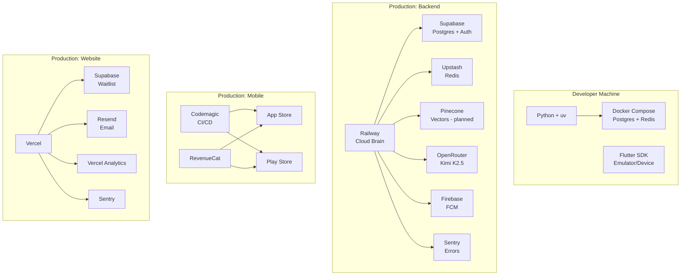

# Zuralog — Infrastructure & Deployment

**Version:** 2.0  
**Last Updated:** 2026-03-01  
**Status:** Living Document

---

## 1. Development Environment

Zuralog uses a **Hybrid Development** approach: application code runs natively on the developer's machine for speed; infrastructure services run in Docker for isolation.

**Why Hybrid?**

| Option | Decision |
|--------|----------|
| **Hybrid (code local + services in Docker)** | ✅ **Chosen** — Fast dev loop, no WSL2 I/O penalty, easy debugging |
| Full Docker (code + services) | ❌ 10–50× slower file I/O on Windows (WSL2 mount penalty), painful hot-reload |
| Nothing (install everything locally) | ❌ "Works on my machine" problems, hard to reproduce |

### Quick Start (Cloud Brain)

```bash
git clone <repo>
docker compose up -d                          # Start Postgres + Redis
uv sync                                       # Create .venv/, install all deps
uv run uvicorn app.main:app --reload          # Start FastAPI dev server
```

### Key Files

| File | Purpose |
|------|---------|
| `cloud-brain/pyproject.toml` | Python version + all dependencies |
| `cloud-brain/uv.lock` | Exact dependency lockfile (deterministic) |
| `cloud-brain/docker-compose.yml` | Local Postgres + Redis containers |
| `cloud-brain/.env.example` | Env var template (never commit `.env`) |
| `cloud-brain/Dockerfile` | Production container build |
| `cloud-brain/Makefile` | Dev commands (`make dev`, `make test`, `make lint`) |
| `cloud-brain/RAILWAY_ENV_VARS.md` | Complete env var reference for Railway deployment |

---

## 2. Production Services

All services used in production, current tier, and purpose:

| Service | Role | Free Tier Limits | Current Cost |
|---------|------|-----------------|--------------|
| **Railway** | Backend hosting (Cloud Brain) | $5 trial credit | ~$5–10/mo |
| **Supabase** | PostgreSQL + Auth + Row Level Security | 500MB DB, 50K MAU | $0 |
| **Upstash** | Serverless Redis — Celery queue + cache layer | 10K req/day | $0 |
| **Pinecone** | Vector DB — AI long-term memory (planned, not active) | 1 index, 100K vectors | $0 |
| **Firebase (FCM)** | Push notifications to mobile | Unlimited | $0 |
| **Sentry** | Error tracking — Cloud Brain + Flutter + Website | 5K events/mo | $0 |
| **PostHog** | Product analytics | 1M events/mo | $0 |
| **RevenueCat** | Subscription billing (App Store + Play Store) | Free until $2.5K MTR | $0 |
| **Codemagic** | Flutter CI/CD (`.ipa` + `.aab` builds) | 500 build-min/mo | $0 |
| **Vercel** | Website hosting | Free | $0 |
| **Vercel Analytics** | Website traffic analytics | Free | $0 |
| **Resend** | Transactional email (waitlist confirmations) | 3K emails/mo | $0 |
| **Cloudflare** | DNS + SSL + CDN + DDoS protection | Unlimited | $0 |

### One-Time / Annual Costs

| Item | Cost | Frequency |
|------|------|-----------|
| Google Play Developer | $25 | One-time |
| Apple Developer Program | $99 | Yearly |
| Domain (zuralog.app) | ~$15 | Yearly |
| **Total Upfront** | ~$140 | |

---

## 3. Deployment Architecture

### 3.1 Cloud Brain → Railway

**Flow:**
1. Push to `main` branch on GitHub
2. Railway auto-detects push, builds `Dockerfile`
3. Blue-green deployment (zero downtime)
4. Health check endpoint validates new instance
5. Old instance retired

**Why Railway:** GitHub auto-deploy, built-in logging, cron support, Docker-native, simple pay-per-compute pricing. Migration path to AWS ECS/Fargate at scale.

### 3.2 Mobile App → App Store / Play Store

**CI/CD:** Codemagic

**Flow:**
1. Push to `main`
2. Codemagic builds `.ipa` (iOS) and `.aab` (Android)
3. Auto-upload to TestFlight + Google Play Internal Testing
4. Manual promotion to production after QA

### 3.3 Website → Vercel

**Flow:**
1. Push to `main`
2. Vercel auto-deploys via Next.js build
3. Preview deployments on PRs
4. Production on `main`

---

## 4. Monitoring & Observability

| Platform | What's Monitored | Config |
|---------|------------------|----|
| **Sentry (Cloud Brain)** | FastAPI exceptions, Celery task failures, slow queries | `sentry-sdk[fastapi,celery,sqlalchemy,httpx]` in pyproject.toml |
| **Sentry (Flutter)** | Dart exceptions, network errors, app crashes | `sentry_flutter` + `sentry_dio` in pubspec.yaml |
| **Sentry (Website)** | Next.js server errors, client errors | `@sentry/nextjs` in package.json |
| **Vercel Analytics** | Website traffic, Core Web Vitals | `@vercel/analytics` |
| **PostHog** | Feature usage, funnel analytics, user journeys | (Cloud Brain events) |

**Sentry Configuration (Cloud Brain):**
- `sentry_traces_sample_rate`: 1.0 (dev), lower in prod
- `sentry_profiles_sample_rate`: 0.25
- Integrated with FastAPI middleware, Celery signals, SQLAlchemy

---

## 5. AI & Variable Cost Model

| Service | Model | Cost/User/Month | Notes |
|---------|-------|----------------|-------|
| **Kimi K2.5** | Via OpenRouter (`moonshotai/kimi-k2.5`) | ~$2.16 | Based on ~30 msgs/day/user |
| **Whisper STT** | OpenAI API (`whisper-1`) | ~$0.50 | Based on heavy voice usage ($0.006/min) |
| **OpenAI Embeddings** | `text-embedding-3-small` | ~$0.05 | For Pinecone vector store (planned) |

### Revenue Share (Post-Launch)

| Platform | Commission |
|----------|------------|
| Apple App Store | 15% (Small Business Program, first $1M/yr) |
| Google Play | 15% (first $1M/yr) |
| RevenueCat | Free until $2.5K MTR, then 1% |

### Cost Projections

| Phase | Monthly Infrastructure | LLM Costs | Total |
|-------|----------------------|-----------|----|
| Development (pre-launch) | ~$5 | ~$0 | ~$5 |
| Early Launch (100 users) | ~$10 | ~$216 | ~$226 |
| 100 Paying Users ($9.99/mo) | ~$10 | ~$216 | Revenue: ~$700 net |
| **Net profit at 100 users** | | | **~$474/mo** |

### Cost Risks

1. **LLM costs** — Primary COGS. Scales linearly with message volume. **Mitigation:** Rate limiting per tier, response caching for common queries.
2. **Supabase Pro upgrade** — Required at ~500 active users (> 500MB DB). Cost: $25/mo.
3. **Integration API rate limits** — Not a cost issue, but operational. **Mitigation:** Intelligent caching, webhook-driven sync over polling, per-provider rate limiters in Redis.

---

## 6. Environment Variables Reference

See `cloud-brain/RAILWAY_ENV_VARS.md` for the complete list of all env vars required for production deployment. Key categories:

| Category | Variables |
|----------|---------|
| Database | `DATABASE_URL`, `SUPABASE_URL`, `SUPABASE_ANON_KEY`, `SUPABASE_SERVICE_KEY` |
| Redis | `REDIS_URL`, `UPSTASH_REDIS_REST_URL`, `UPSTASH_REDIS_REST_TOKEN` |
| LLM | `OPENROUTER_API_KEY`, `OPENROUTER_MODEL` (default: `moonshotai/kimi-k2.5`) |
| Auth | `GOOGLE_WEB_CLIENT_ID`, `GOOGLE_WEB_CLIENT_SECRET` |
| Strava | `STRAVA_CLIENT_ID`, `STRAVA_CLIENT_SECRET`, `STRAVA_WEBHOOK_VERIFY_TOKEN` |
| Fitbit | `FITBIT_CLIENT_ID`, `FITBIT_CLIENT_SECRET`, `FITBIT_WEBHOOK_VERIFY_CODE`, `FITBIT_WEBHOOK_SUBSCRIBER_ID` |
| Notifications | `FCM_CREDENTIALS_PATH` or `FIREBASE_CREDENTIALS_JSON` |
| Subscriptions | `REVENUECAT_WEBHOOK_SECRET`, `REVENUECAT_API_KEY` |
| Monitoring | `SENTRY_DSN` |
| AI (planned) | `PINECONE_API_KEY`, `OPENAI_API_KEY` |

---

## 7. System Architecture Diagram


