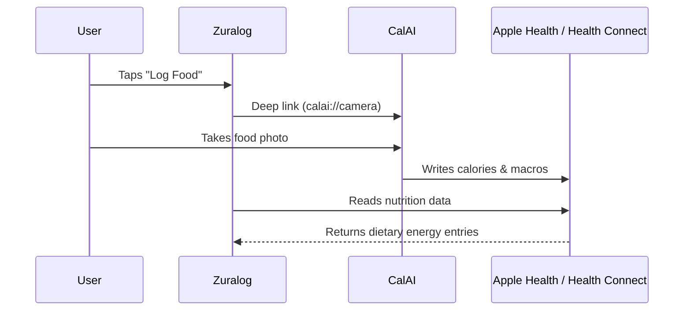

# CalAI Integration Reference

## Overview

We integrate with CalAI using a **"Zero-Friction"** approach that relies on OS-level data sharing rather than direct API-to-API communication.

## Data Flow

1. **User** clicks "Log Food" in Zuralog.
2. **App** deep links to CalAI (`calai://camera`).
3. **User** takes photo in CalAI.
4. **CalAI** processes photo and writes Calories/Macros to Apple Health / Health Connect.
5. **Zuralog** reads new nutrition data from Apple Health / Health Connect via the MCP server `read_metrics` tool with `data_type: "nutrition"`.

## Advantages

- **No API keys** or OAuth needed for CalAI.
- **User owns the data** in their OS Health wallet.
- **Works even if CalAI changes their API** — we read from the Health Store, not CalAI directly.
- **Works with any nutrition app** — MyFitnessPal, Cronometer, etc. all write to the same Health Store.

## Requirements

- User must grant **"Write"** permissions to CalAI in their OS Health settings.
- User must grant **"Read"** permissions to Zuralog in their OS Health settings.
- CalAI must be installed, or user will be directed to the CalAI website/App Store.

## Implementation Details

| Component | File | Change |
|-----------|------|--------|
| Deep link launcher | `zuralog/lib/core/deeplink/deeplink_launcher.dart` | New — launches CalAI with fallback |
| Apple Health MCP | `cloud-brain/app/mcp_servers/apple_health_server.py` | Added `nutrition` to `read_metrics` enum |
| Health Connect MCP | `cloud-brain/app/mcp_servers/health_connect_server.py` | Added `nutrition` to `read_metrics` enum |
| Health Bridge | `zuralog/lib/core/health/health_bridge.dart` | Added `getNutrition()` method |
| Health Repository | `zuralog/lib/features/health/data/health_repository.dart` | Added `getNutrition()` method |
| Harness | `zuralog/lib/features/harness/harness_screen.dart` | Added CalAI + Read Nutrition buttons |
