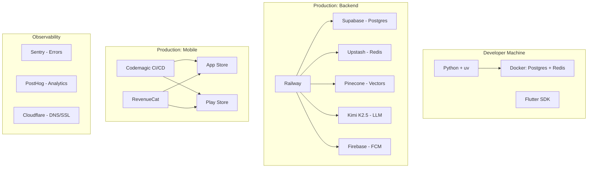

# Zuralog — Infrastructure & Deployment Guide

**Version:** 1.0
**Date:** February 19, 2026
**Status:** Approved

---

## 1. Development Environment Strategy

Zuralog uses a **Hybrid Development** approach: application code runs natively on the developer's machine for maximum speed, while infrastructure services (databases, queues) run inside Docker containers for isolation.

### 1.1 Why Hybrid (Not Full Docker)?

| Approach | Pros | Cons |
|----------|------|------|
| **Full Docker** (code + services) | Perfect prod parity | 10-50x slower file I/O on Windows (WSL2 mount penalty), painful hot-reload, complex debugging |
| **Hybrid** (code local + services in Docker) | Fast dev loop, clean OS, easy debugging | Minor env difference vs production (mitigated by CI testing) |
| **No Docker** (install everything locally) | Fastest possible | Pollutes OS, "works on my machine" problems, hard to replicate |

**Decision:** Hybrid gives 95% of Docker's benefits with none of the Windows performance penalties.

### 1.2 Local Development Stack

```
┌─────────────────────────────────────────────────┐
│  DEVELOPER MACHINE                              │
│                                                 │
│  ┌────────────────────────┐                     │
│  │  Python Backend         │ ← uv + .venv/     │
│  │  (FastAPI application)  │   (project-local)  │
│  └────────────┬───────────┘                     │
│               │ connects to                     │
│  ┌────────────┴───────────┐                     │
│  │  Docker Compose         │ ← containers      │
│  │  ├─ PostgreSQL:5432     │                    │
│  │  └─ Redis:6379          │                    │
│  └────────────────────────┘                     │
│                                                 │
│  ┌────────────────────────┐                     │
│  │  Flutter (Edge Agent)   │ ← native SDK      │
│  │  (Android/iOS dev)      │   (not Docker)     │
│  └────────────────────────┘                     │
└─────────────────────────────────────────────────┘
```

| Component | Tool | Purpose |
|-----------|------|---------|
| **Python** | `uv` + `.venv/` | Fast virtual environment, project-local. All deps install into `.venv/` inside the project directory. |
| **Python Version** | Managed by `uv` | Declared in `pyproject.toml`. `uv` auto-downloads the correct version. |
| **PostgreSQL** | Docker Compose | Local database. Same version as production (Supabase uses Postgres 15). |
| **Redis** | Docker Compose | Local task queue for Celery. |
| **Flutter** | Native Flutter SDK | Standard installation. Docker is incompatible with mobile emulators. |

### 1.3 Production Stack

In production, the Python backend is fully containerized via a `Dockerfile` and deployed to a PaaS. Infrastructure services are managed (Supabase, Upstash).

| Component | Local Dev | Production |
|-----------|-----------|------------|
| Python App | `uv run uvicorn ...` (native) | Docker container (Railway/Fly.io) |
| PostgreSQL | Docker Compose container | Supabase (managed) |
| Redis | Docker Compose container | Upstash (serverless) |
| Flutter App | Emulator / Physical device | App Store / Play Store |

---

## 2. Developer Onboarding

### 2.1 Quick Start (4 Commands)

```bash
git clone <repo>
docker compose up -d            # Start Postgres + Redis
uv sync                         # Create .venv/ and install all Python deps
uv run uvicorn app.main:app --reload  # Start backend
```

### 2.2 Key Files for Reproducibility

| File | Purpose |
|------|---------|
| `pyproject.toml` | Declares Python version, all dependencies, dev tools |
| `uv.lock` | Exact dependency lockfile (deterministic installs) |
| `docker-compose.yml` | Spins up Postgres + Redis for local dev |
| `.env.example` | Template for environment variables (never commit `.env`) |
| `Dockerfile` | Production build of the Python backend |
| `Makefile` | Common commands (`make dev`, `make test`, `make lint`) |
| `CONTRIBUTING.md` | Step-by-step setup guide for new developers |

### 2.3 Developer Choice

Developers may choose their preferred workflow:

**Option A — Hybrid (Recommended):**
Python runs locally for fast iteration; only services are dockerized.

**Option B — Full Docker:**
For developers who prefer zero local installation. Uses a `docker-compose.full.yml` profile.

```bash
docker compose --profile full up  # Everything in containers
```

---

## 3. Deployment Architecture

### 3.1 Backend (Cloud Brain)

**Strategy:** Docker-based PaaS deployment.
**Service:** Railway (primary) or Fly.io (alternative).

**Deployment Flow:**
1. Developer pushes to `main` branch.
2. Railway detects the push, builds the `Dockerfile`.
3. Blue-green deployment — zero downtime.
4. Health check endpoint validates the new instance.

**Why Railway?**
- GitHub integration with auto-deploy.
- Built-in logging, metrics, and cron jobs.
- Supports Docker natively.
- Simple pricing (pay for compute used).
- Migrate to AWS ECS/Fargate at scale if needed.

### 3.2 Mobile App (Edge Agent)

**Strategy:** App Store + Play Store distribution.
**CI/CD Service:** Codemagic.

**Deployment Flow:**
1. Developer pushes to `main` branch.
2. Codemagic builds `.ipa` (iOS) and `.aab` (Android).
3. Automatic upload to TestFlight (iOS) and Google Play Internal Testing (Android).
4. Manual promotion to production after QA review.

---

## 4. Services & Cost Analysis

### 4.1 Fixed / One-Time Costs

| Item | Cost | Frequency |
|------|------|-----------|
| Google Play Developer | $25 | One-time |
| Apple Developer Program | $99 | Yearly |
| Domain Name (e.g., `api.zuralog.com`) | ~$10-15 | Yearly |
| **Total Upfront** | **~$140** | |

### 4.2 Infrastructure Services (Scale-Dependent)

Most services have free tiers that cover the full MVP development and early launch phase.

| Service | Role | Free Tier Limits | Est. MVP Cost |
|---------|------|------------------|---------------|
| **Supabase** | PostgreSQL + Auth + RLS | 500MB DB, 50K MAU | $0 |
| **Railway** | Backend hosting | $5 trial credit | ~$5-10/mo |
| **Upstash** | Redis (serverless) | 10K req/day | $0 |
| **Pinecone** | Vector DB (AI memory) | 1 index, 100K vectors | $0 |
| **Firebase** | Push notifications (FCM only) | Unlimited | $0 |
| **Sentry** | Error tracking | 5K events/mo | $0 |
| **PostHog** | Product analytics | 1M events/mo | $0 |
| **Codemagic** | Flutter CI/CD | 500 build-mins/mo | $0 |
| **Cloudflare** | DNS + SSL + CDN | Unlimited | $0 |

### 4.3 AI & Variable Costs (Per-User)

| Service | Pricing Model | Est. per User/Month |
|---------|---------------|---------------------|
| **Kimi K2.5** (LLM) | Usage-based tokens | ~$2.16 (at ~30 msgs/day) |
| **Whisper** (Voice STT) | ~$0.006/min | ~$0.50 (heavy voice usage) |

### 4.4 Revenue Share (Post-Launch)

| Platform | Commission |
|----------|-----------|
| Apple App Store | 15% (Small Business Program, first $1M/year) — 30% otherwise |
| Google Play Store | 15% (first $1M/year) |
| RevenueCat | Free until $2.5K MTR, then 1% |

### 4.5 Cost Projection Summary

| Phase | Monthly Cost |
|-------|-------------|
| **Development (pre-launch)** | ~$5-10 |
| **Early Launch (~100 users)** | ~$250 (hosting + LLM) |
| **Revenue (~100 paying users)** | ~$700 (after store cuts) |
| **Net at 100 users** | ~$450 profit/mo |

### 4.6 Cost Risks to Monitor

1. **LLM API costs** — Primary COGS. If user message volume exceeds projections, costs scale linearly. **Mitigation:** Rate limiting per subscription tier, response caching for common queries.
2. **Supabase Pro upgrade** — Required when exceeding 500MB DB or needing daily backups. Expected around ~500 active users. Cost: $25/mo.
3. **Strava API rate limits** — Free but throttled (100 req/15 min). Not a cost issue but an operational one. **Mitigation:** Intelligent caching + Celery queue with exponential backoff.

---

## 5. Service Reference Map

Complete mapping of every external service used by Zuralog.



---

## Appendix: Document References

| Document | Location |
|----------|----------|
| Architecture Design | `docs/plans/architecture-design.md` |
| Final Implementation Plan | `docs/plans/final-plan.md` |
| Execution Plan | `docs/plans/execution-plan.md` |
| Phase 1.1 Setup | `docs/plans/backend/phases/phase-1.1-foundation-and-infrastructure/` |

---

*End of Document*
