# ZuraLog Design Inspiration Board

> A curated collection of design inspiration from award-winning websites, analyzed for how each element can elevate ZuraLog's visual identity. Each entry includes why it's the best in its category, why it fits our brand, and why we should implement it.

---

## Our Current Design DNA (for context)

| Element | Current State |
|---------|--------------|
| **Stack** | Next.js 16, Tailwind v4, GSAP + ScrollTrigger, Three.js, Framer Motion |
| **Palette** | Cream `#FAFAF5`, Lime `#E8F5A8`, Sage `#CFE1B9`, Charcoal `#2D2D2D` |
| **Animations** | Scroll-driven background color blending, 3D phone model, floating icons, bento grid |
| **Typography** | Geist Sans + Geist Mono |
| **Sections** | Hero → MobileSection (pinned) → BentoSection (dark) → WaitlistSection |

---

## 1. Stripe — Animated Mesh Gradient Background

**URL:** https://stripe.com

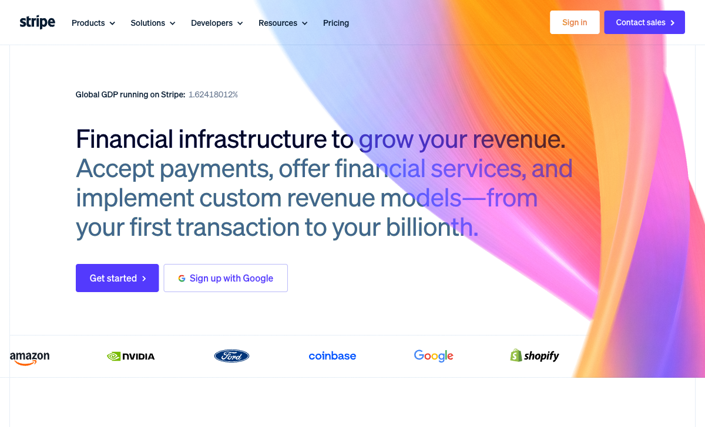

### What to Yoink
Stripe's famous **WebGL animated mesh gradient** in the hero section. Soft color blobs morph and drift across the background using GPU-accelerated shaders. The effect is mesmerizing but never distracting — it adds depth and life to what would otherwise be a flat background.

### Why This Is the Best Design
- **Performance:** Only ~800 lines of WebGL code, runs entirely on GPU — zero impact on CPU/RAM
- **Perception:** Makes visitors feel they've landed on something premium and alive
- **Industry standard:** This effect has been reverse-engineered and adopted by hundreds of top SaaS sites because it works
- **Subtlety:** The animation is slow and organic, never competing with content

### Why It's a Good Fit for ZuraLog
Our `PageBackground` component already does scroll-driven color transitions between cream, sage, blue, pink, and charcoal. But each section is a **flat color**. Replacing flat backgrounds with slow-moving gradient mesh animations *within* each color stop would transform the entire feel. Imagine sage greens softly melting into cream, or soft pinks flowing into blues — matching our existing pastel palette but now feeling alive.

### Why We Should Implement It
- Open-source implementations exist: [`stripe-gradient`](https://github.com/thelevicole/stripe-gradient), [`wave-gradient`](https://github.com/sa3dany/wave-gradient)
- Compatible with our existing GSAP scroll system — we'd layer the gradient *behind* our current color transitions
- Instant "premium" perception upgrade with minimal code changes
- Works beautifully with light/pastel palettes (most implementations default to dark — our cream palette would stand out)

---

## 2. Linear — Precision Typography & Dark Section Design

**URL:** https://linear.app

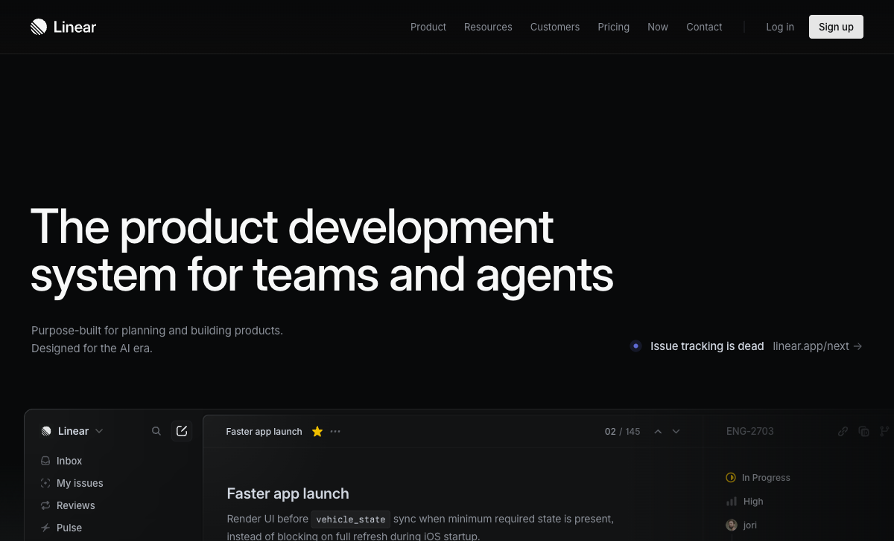

### What to Yoink
Linear's **razor-sharp typographic scale system**, their **dot-grid loading animations** (wave-like opacity patterns across grid dots), and the **subtle glow effect** behind hero text. Their dark sections use carefully calibrated neutral tones with one accent color — never pure black, always sophisticated charcoal with depth.

### Why This Is the Best Design
- **The "Linear Effect"** is now a recognized design movement — clean, minimal, developer-focused aesthetics that feel expensive
- Their type scale system (title-2 through title-9) ensures perfect hierarchy at every breakpoint
- Staggered dot-grid animations (2800-3200ms cycles) create visual interest without being flashy
- Their dark mode isn't just "dark background + white text" — it's a complete tonal system with quaternary colors for depth

### Why It's a Good Fit for ZuraLog
Our BentoSection already transitions to dark charcoal (`#2D2D2D`). Right now it's a flat dark background. Borrowing Linear's approach — adding a subtle dot-grid texture, carefully calibrated gray variations for card borders vs. backgrounds vs. text — would make our dark section feel intentional and premium rather than just "the dark part."

### Why We Should Implement It
- Our Geist Sans font already pairs well with Linear's minimalist aesthetic
- The dot-grid pattern is pure CSS (repeating radial gradients) — no library needed
- Staggered animation timing creates perceived sophistication with zero performance cost
- Elevates our BentoSection from "dark background with cards" to "immersive dark experience"

---

## 3. Huly — Video Backgrounds & Glassmorphic Cards

**URL:** https://huly.io

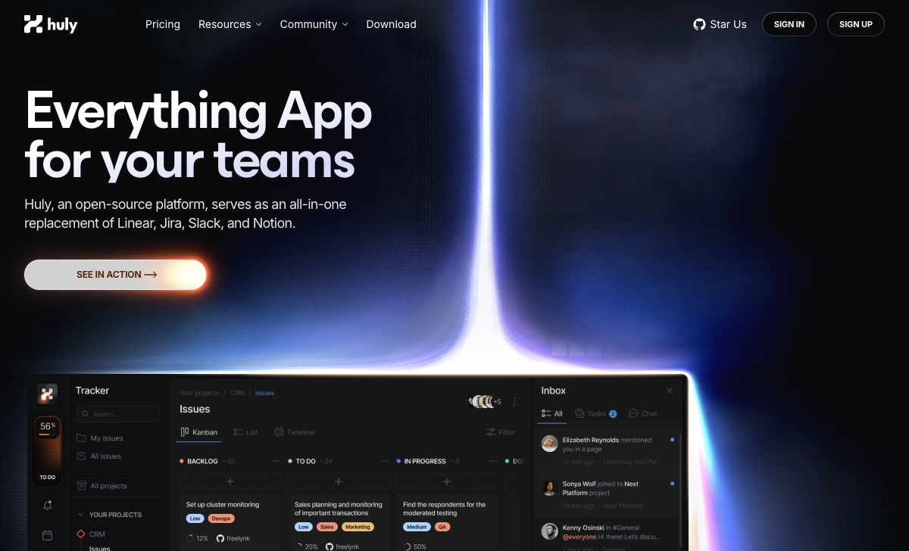

### What to Yoink
Three standout elements: (1) **Looping video backgrounds** behind feature sections with `blur-3xl` gradient overlays, (2) **Glassmorphic cards** with `ring-[6px] ring-white/40` creating gorgeous depth, and (3) their **gradient text effect** (`from-white via-[#d5d8f6] to-[#fdf7fe]`) on hero headlines. Also: their **infinite-scroll feature carousel** with mirrored duplicate lists for seamless looping.

### Why This Is the Best Design
- The video backgrounds add **motion storytelling** — each section feels alive and contextual
- Glassmorphic cards with ring effects create a sense of layered depth that flat cards can't match
- The gradient text makes headlines feel like they glow — it's subtle but your eye catches it
- The infinite carousel solves the "too many features to show" problem elegantly

### Why It's a Good Fit for ZuraLog
- Our hero headline could use gradient text in sage/lime tones — matching our brand while adding polish
- The glassmorphic card style would upgrade our BentoSection cards from solid white/dark to frosted glass
- An infinite feature carousel could replace or augment our MobileSection pinned slides — showing more features without requiring users to scroll through 4 full viewports
- Video backgrounds in our pastel palette sections would add motion without weight

### Why We Should Implement It
- Gradient text is a single Tailwind class: `bg-gradient-to-r from-[#E8F5A8] via-[#CFE1B9] to-[#DAEEF7] bg-clip-text text-transparent`
- Glassmorphic cards require only `backdrop-blur` + `bg-white/10` + ring — all native Tailwind
- The infinite carousel pattern (duplicate list + CSS animation) is well-documented and lightweight
- These are all *additive* changes — they enhance what we have without requiring restructuring

---

## 4. Raycast — 3D WebGL Hero with Mouse-Tracked Parallax

**URL:** https://raycast.com

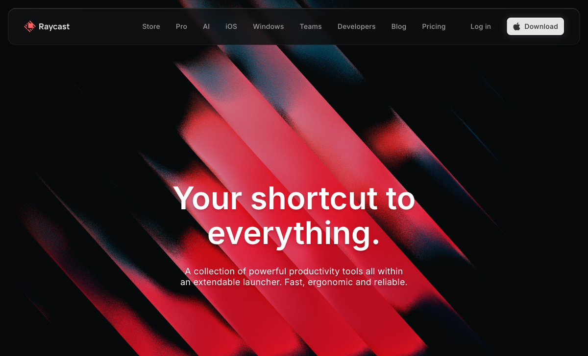

### What to Yoink
Their hero has a **full-screen 3D scene** rendered in WebGL with dramatic diagonal light streaks that respond to mouse movement. The background uses **shader-driven color cycling** (cyan, magenta, red) on a near-black base. Their extension cards feature **anisotropic blur hover effects** and **three-layer depth shadow systems**.

### Why This Is the Best Design
- The 3D hero is **immersive without being gimmicky** — it feels like you're looking into a space, not at a website
- Mouse-tracked parallax creates a sense of depth that makes the page feel responsive to the user
- The three-layer shadow system on cards (base shadow + inset highlight + color shadow) creates realistic depth
- The color palette is bold but controlled — vibrant accents against deep darks

### Why It's a Good Fit for ZuraLog
We already have a 3D phone model via `ClientShellGate` that loads Three.js. **Adding mouse-tracked parallax** to the phone (it subtly rotates as the cursor moves) would be a low-effort, high-impact upgrade. We already have the Three.js infrastructure — this is just adding mouse event listeners to influence camera/model rotation.

### Why We Should Implement It
- We already pay the Three.js bundle cost — mouse tracking adds ~20 lines of code
- The parallax effect makes the 3D phone feel interactive even before users scroll
- Our BentoSection's `Card 4` already has magnetic 3D tilt on mouse move — extending this pattern to the hero phone is consistent
- Transforms our 3D phone from "cool tech demo" to "interactive product showcase"

---

## 5. Aceternity UI — Aurora Background & Component Library

**URL:** https://ui.aceternity.com

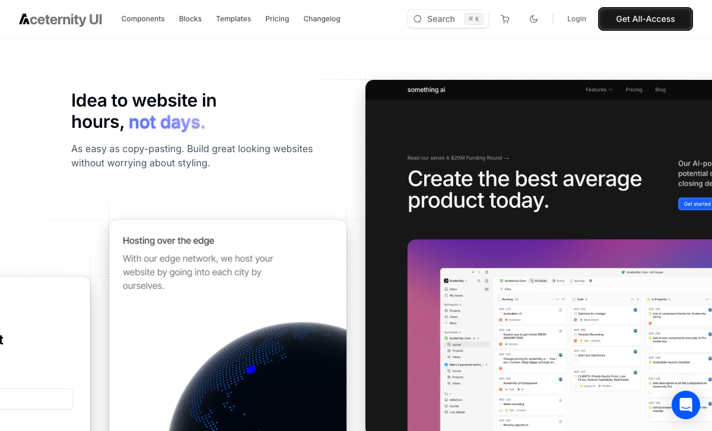
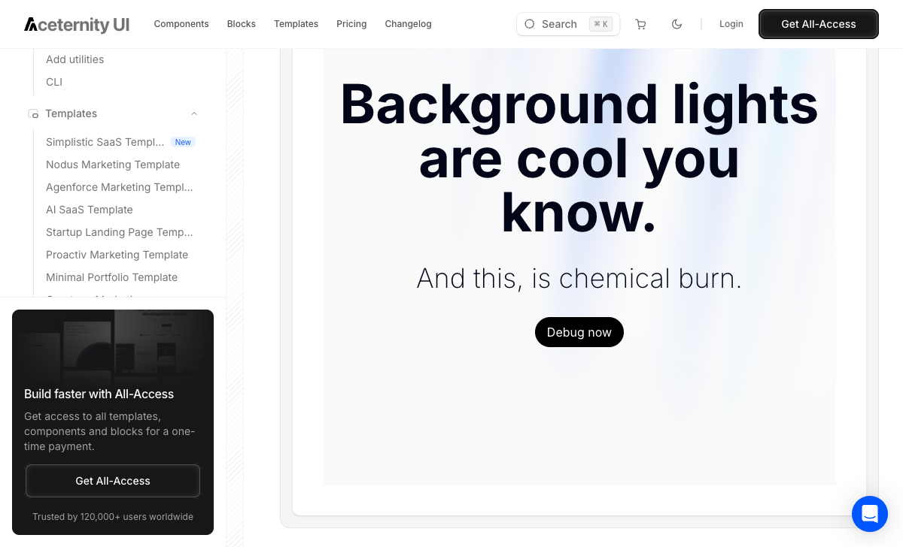

### What to Yoink
The **Aurora Background component** — a ready-made React/Tailwind/Framer Motion component that creates a beautiful aurora borealis effect as a page background. Also their **Background Gradient Animation** (Stripe-like but simpler), **animated border traces** on cards, and **spotlight hover effects**.

### Why This Is the Best Design
- **Copy-paste ready** — these aren't just inspiration, they're production components
- 200+ components all built with React + Tailwind + Framer Motion (our exact stack)
- The aurora effect creates ambient light without the complexity of full WebGL
- Their animated border traces (a glowing line that follows the card border on hover) are the kind of micro-interaction that separates "nice" from "wow"

### Why It's a Good Fit for ZuraLog
- The Aurora Background in our pastel colors would be a stunning hero background — more dynamic than flat cream but lighter than full WebGL mesh gradients
- Animated border traces on our BentoSection cards would make features feel interactive before users even click
- Their spotlight hover effect (radial gradient that follows cursor on cards) matches our existing magnetic tilt pattern on Card 4

### Why We Should Implement It
- **Zero learning curve** — it's Tailwind + Framer Motion, which we already use
- `npx aceternity-ui add aurora-background` installs the component directly
- Can be implemented incrementally — start with one section, expand if it works
- Proven at scale (120,000+ users, $20M Series A)

---

## 6. Magic UI — Animated Bento Grid & Micro-Interactions

**URL:** https://magicui.design

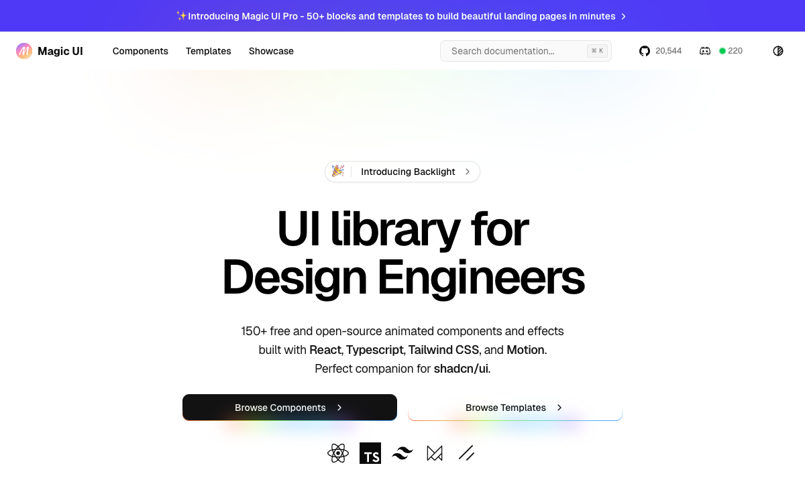

### What to Yoink
Their **animated bento grid** components with built-in micro-interactions: cards that scale on hover, **staggered entrance animations**, **animated border traces** with gradient glow, **orbiting circles** decorative elements, and **number ticker** animations.

### Why This Is the Best Design
- 150+ components specifically designed for SaaS landing pages
- The border beam effect (a light that travels around card borders) is the most requested micro-interaction in modern web design
- Number tickers (animated counting) add perceived dynamism to stats sections
- Everything is built on shadcn/ui primitives — the industry standard

### Why It's a Good Fit for ZuraLog
Our `BentoSection` is a 6-card grid that currently uses Framer Motion entrance animations. Magic UI's bento components add:
- **Border beam effects** — a glowing line that traces card borders on hover
- **Orbiting circles** — decorative elements that orbit around feature icons
- **Number tickers** — our Card 4 (Unified Dashboard) already has GSAP counter animations, but Magic UI's ticker is smoother and more configurable
- **Staggered grid entrance** — more sophisticated than our current spring-based reveal

### Why We Should Implement It
- Drop-in compatible: React + TypeScript + Tailwind + Motion (our stack exactly)
- 19,000+ GitHub stars — battle-tested and well-maintained
- Each component is independent — we can cherry-pick border beams for bento cards without importing the whole library
- The components respect dark mode automatically — perfect for our BentoSection's charcoal background

---

## 7. Liveblocks — Bento Feature Grid with Live Demos

**URL:** https://liveblocks.io

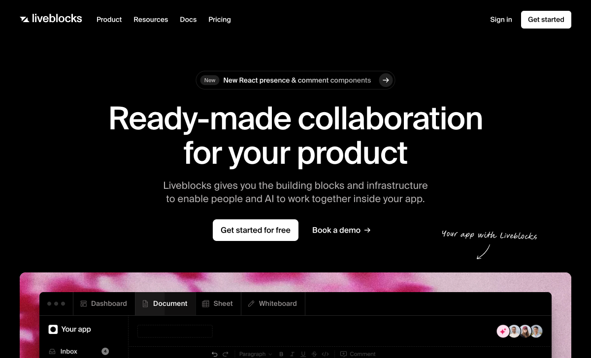

### What to Yoink
Their homepage bento grid where **each card contains a live interactive demo** of the actual product feature (a working comment thread, a real-time cursor, etc.). Cards use `lg:group-hover:scale-95` subtle scale-down effects and blur transitions. Their dark palette with CSS custom properties for accent colors is exceptionally clean.

### Why This Is the Best Design
- **Show, don't tell** taken to its logical extreme — the marketing page IS the product demo
- The subtle scale-down on hover (rather than scale-up) feels premium and intentional
- CSS custom properties for theming makes the color system maintainable and consistent
- The trust section (SOC 2, HIPAA badges) is integrated into the visual flow rather than tacked on

### Why It's a Good Fit for ZuraLog
Our BentoSection Card 4 (Unified Dashboard) already has an interactive demo with cycling metric cards and 3D flip animations. **Extending this pattern to ALL bento cards** — each showing a mini live demo of a ZuraLog feature — would make our feature section dramatically more convincing than static descriptions.

### Why We Should Implement It
- We've already proven the pattern works with Card 4 — this is about expanding it
- The scale-down hover effect is a single Tailwind class change
- Embedding mini product demos converts better than screenshots (Liveblocks credits this approach for their growth)
- Our quiz-based WaitlistSection already proves we can build interactive marketing elements — this extends that philosophy to the feature grid

---

## 8. Resend — Radical Minimalism & 3D Product Showcase

**URL:** https://resend.com

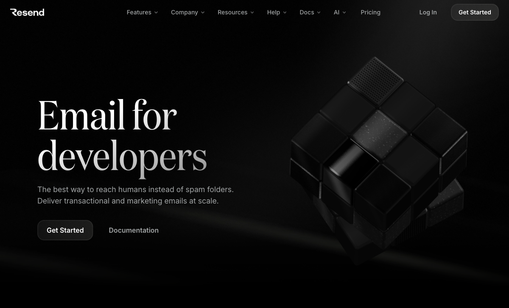

### What to Yoink
Their **radical minimalism** — dark background, generous whitespace, one serif headline font contrasting with sans-serif body, and a stunning **3D Rubik's cube** hero element (built with Spline). The restraint is the design — every pixel earns its place. Also: mixing monospace code elements with clean marketing copy.

### Why This Is the Best Design
- **Restraint IS the statement** — in a world of over-designed SaaS pages, Resend's simplicity feels confident and expensive
- The serif/sans-serif font pairing (editorial headline + clean body) creates instant visual hierarchy
- The 3D hero object is interactive and tactile — it's not decoration, it's an experience
- Dark backgrounds with minimal elements create a sense of premium exclusivity

### Why It's a Good Fit for ZuraLog
When ZuraLog eventually adds dark mode or a dark landing page variant, Resend is the gold standard. Their approach teaches us that **not every section needs a wow effect** — sometimes the most impactful design choice is removing elements, not adding them. The 3D product showcase (built with Spline) validates our existing Three.js phone model approach.

### Why We Should Implement It
- Study this for our dark sections — how to make `#2D2D2D` feel immersive with restraint
- The serif/sans-serif headline pattern could work for our hero: editorial Geist Mono for the headline, Geist Sans for body
- Their whitespace ratios (massive padding between sections) could inform a redesign pass
- Validates our 3D phone model investment — Resend proves 3D heroes convert

---

## 9. Vercel — GPU-Accelerated Animation Philosophy

**URL:** https://vercel.com

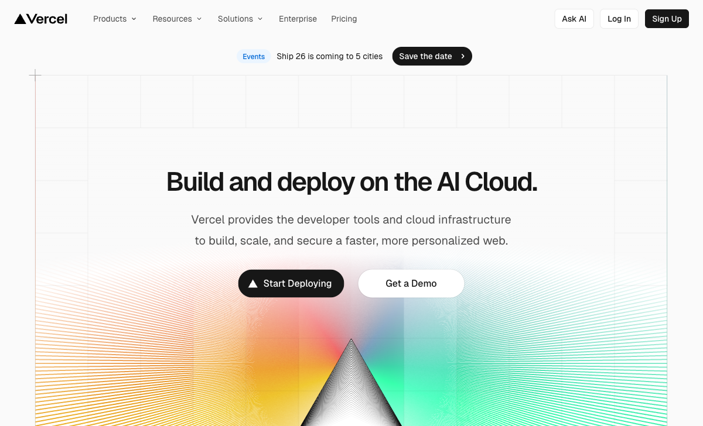

### What to Yoink
Their **animation philosophy**: only animate `transform` and `opacity` (GPU-accelerated properties), never `width`, `height`, `top`, or `left`. Animations only occur when they **clarify cause-and-effect** or add deliberate delight. Their Geist design system (which we already use!) and their prismatic light hero effect with geometric forms.

### Why This Is the Best Design
- **Performance-first animation** — every motion is GPU-accelerated, resulting in butter-smooth 60fps
- The restraint principle: "if an animation doesn't serve a purpose, remove it"
- The prismatic hero (light refraction through geometric shapes) is unique and memorable
- Their design system documentation is the most thorough in the industry

### Why It's a Good Fit for ZuraLog
We already use Geist fonts and GSAP for animations. Adopting Vercel's animation philosophy means **auditing our existing animations** to ensure they're all GPU-friendly. Some of our custom CSS animations (`diagonalDrift`, `dashboardFloat`, `marqueeLeft`) may be animating non-optimal properties. Fixing this would make our site feel faster on every device.

### Why We Should Implement It
- This is a **performance audit**, not a visual change — it makes everything we already have feel better
- Replace any `top`/`left`/`width`/`height` animations with `transform: translate()`/`scale()`
- Add `will-change: transform` to our most animation-heavy elements
- The prismatic light effect could inspire a new hero visual that complements our 3D phone

---

## 10. Vanta.js — Plug-and-Play 3D Backgrounds

**URL:** https://www.vantajs.com

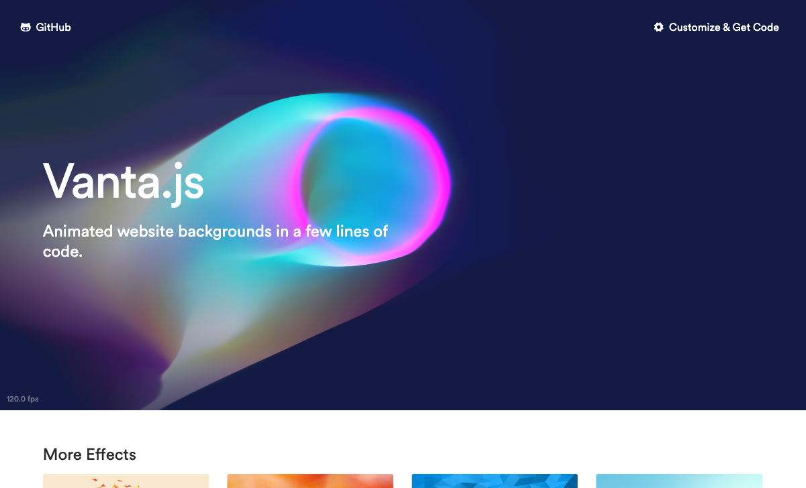

### What to Yoink
A gallery of **plug-and-play animated 3D backgrounds** using Three.js: fog, waves, birds, clouds, net, dots, rings, halo. Each is a single import with fully customizable colors. The **halo effect** (pictured above) creates an otherworldly ambient glow. The **waves effect** creates gentle undulating surfaces.

### Why This Is the Best Design
- **Instant premium** — adding a Vanta background to any section immediately elevates it
- Smaller filesize than background videos (Three.js is ~120kb minified + gzipped)
- Runs at 60fps on most devices with mouse/touch interaction support
- Each effect is independently customizable: colors, speed, density, camera angle

### Why It's a Good Fit for ZuraLog
The **waves effect** in our pastel colors (sage green waves with cream peaks) could be a stunning hero background. The **fog effect** in our charcoal palette would add atmospheric depth to the BentoSection. The **dots effect** matches the dot-grid pattern we'd borrow from Linear. All effects are configurable to match our exact color palette.

### Why We Should Implement It
- We already load Three.js for the 3D phone — Vanta reuses the same dependency
- A single `VANTA.WAVES({ color: 0xCFE1B9, ... })` call creates the entire effect
- Built-in ScrollObserver disables the effect when not in viewport (performance-safe)
- Fallback to static color on mobile (matches our existing `ClientShellGate` pattern of skipping heavy 3D on mobile)

---

## 11. tsParticles — Ambient Particle System

**URL:** https://particles.js.org

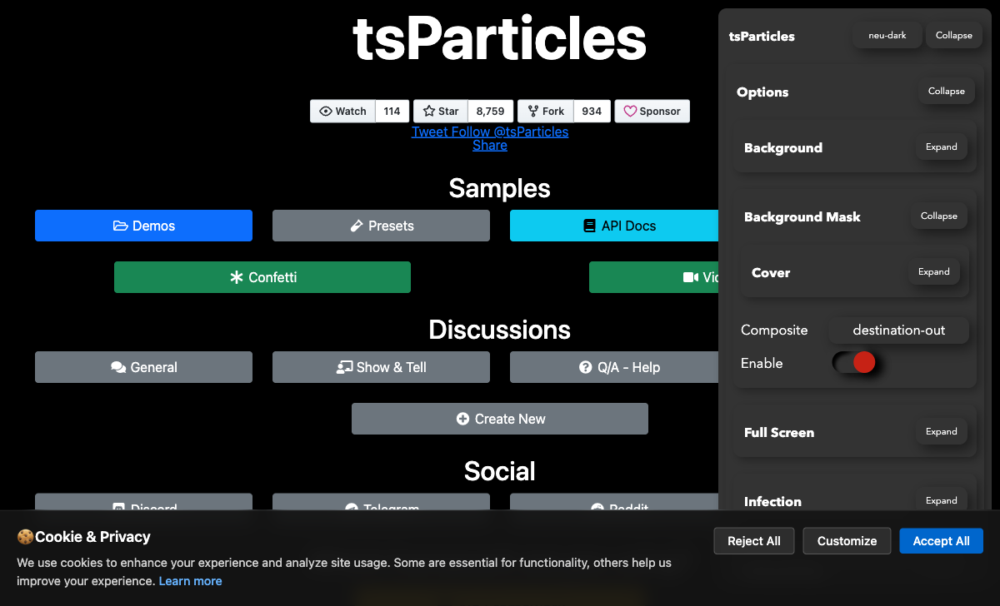

### What to Yoink
Lightweight **particle system** with React/Next.js components. Floating dots, connecting lines, rising bubbles, confetti — all configurable. The **links preset** creates interconnected floating nodes that respond to mouse proximity. The **rising bubbles preset** creates a soothing, organic feel.

### Why This Is the Best Design
- **Ambient life** — particles add perceived motion and energy without being distracting
- Highly performant canvas-based rendering (doesn't impact DOM performance)
- 8,700+ GitHub stars with active maintenance and React integration
- Infinite configurability: density, speed, size, color, connections, interactivity

### Why It's a Good Fit for ZuraLog
Our WaitlistSection already has a `particleFloat` animation in CSS. Replacing it with tsParticles would give us **mouse-interactive particles** — dots that drift away from the cursor, creating a playful feel that matches our brand energy. Subtle golden/lime particles on our cream hero (#FAFAF5) would add life without competing with the 3D phone.

### Why We Should Implement It
- React component available: `@tsparticles/react` drops right into our Next.js app
- Replace our CSS-based `particleFloat` animation with something interactive and configurable
- Can run alongside our existing Three.js phone without conflict (canvas-based, separate layer)
- Configuration is JSON-based — designers can tweak density/speed without touching code

---

## 12. Spline — No-Code Interactive 3D Scenes

**URL:** https://spline.design

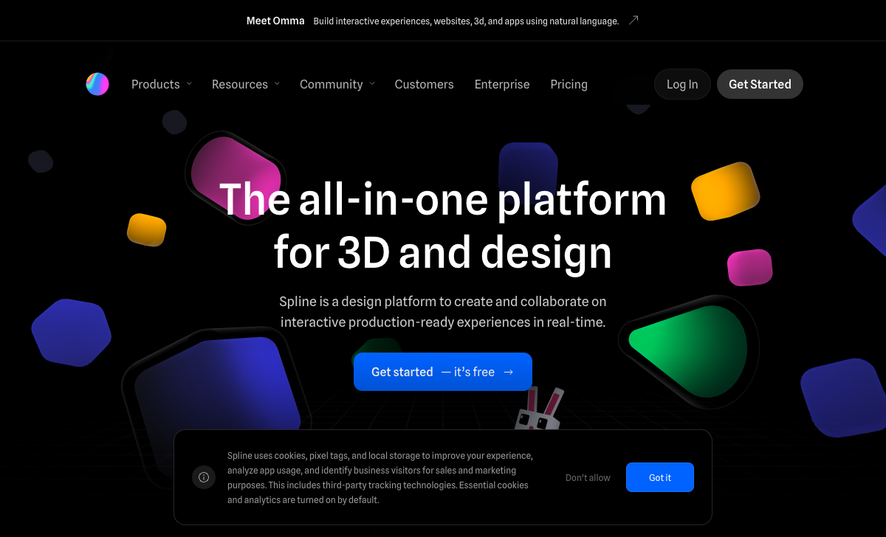

### What to Yoink
A **drag-and-drop 3D scene builder** that exports embeddable React components. Create interactive 3D objects that respond to scroll, hover, and click — with materials, lighting, physics, and particles. Their own hero demonstrates the power: floating 3D shapes with glass materials, depth of field, and mouse-tracked parallax.

### Why This Is the Best Design
- **Resend uses Spline** for their 3D cube hero — proving it's production-ready at scale
- No WebGL coding required — designers create scenes visually, engineers embed with `<spline-viewer>`
- Exports as React components, plain HTML embeds, or native iOS/Android
- Real-time collaboration (like Figma but for 3D)

### Why It's a Good Fit for ZuraLog
Our 3D phone model is currently a static GLTF loaded with Three.js. With Spline, we could create a **full scene** — phone on a desk with floating UI cards around it, ambient particles, environmental lighting — that users can orbit and interact with. This transforms our hero from "3D phone render" to "interactive product experience."

### Why We Should Implement It
- `@splinetool/react-spline` is a single npm package for Next.js integration
- We could build the scene without code, then integrate it alongside our existing Three.js setup
- Spline scenes are optimized for web — smaller than raw GLTF + custom Three.js code
- Used by Google, Shopify, Amazon, OpenAI — proven at enterprise scale

---

## 13. CSS Clip-Path Section Transitions

**URL:** https://freefrontend.com/css-animated-backgrounds/ + https://prismic.io/blog/css-background-effects

### What to Yoink
Instead of simple color fades between sections, use CSS `clip-path` animations for **diagonal wipes, circular reveals, or wave-shaped transitions**. Pure CSS, no JavaScript overhead. Huly already implements this with `mask-image` properties for scroll-triggered reveal effects.

### Why This Is the Best Design
- **Zero JavaScript** — pure CSS means zero performance impact and no framework dependency
- Wave-shaped dividers create organic transitions that feel natural and flowing
- Diagonal wipes add dynamism to section breaks that linear gradients can't match
- These effects work on every browser and device

### Why It's a Good Fit for ZuraLog
Our current section transitions are GSAP-driven color interpolations — the background smoothly shifts from one color to another. Adding a **wave-shaped clip-path divider** between sections (particularly between the pastel MobileSection and the dark BentoSection) would create a much more dramatic and memorable visual break.

### Why We Should Implement It
- Single CSS property: `clip-path: polygon(...)` or `clip-path: ellipse(...)`
- Can be animated with CSS transitions triggered by our existing ScrollTrigger waypoints
- The wave shape between light pastels and dark charcoal would become a signature visual element
- SVG wave generators (like getwaves.io) can create the exact wave pattern we want

---

## 14. Scroll-Synced 3D Storytelling (GSAP + Three.js)

**URL:** https://dev.to/robinzon100/build-an-award-winning-3d-website-with-scroll-based-animations-nextjs-threejs-gsap-3630

### What to Yoink
**Scroll-pinned sections where 3D objects transform as users scroll** — the 3D model rotates, screens change, elements appear/disappear — all synced to scroll position. This "scrollytelling" technique is what wins Awwwards Site of the Day.

### Why This Is the Best Design
- **Narrative-driven** — the scroll becomes the story, not just a navigation mechanism
- Users feel in control of the experience — scroll speed = animation speed
- This technique consistently wins Awwwards and FWA awards
- Combines the best of cinema (controlled sequence) with the best of web (user-paced)

### Why It's a Good Fit for ZuraLog
We ALREADY have all the pieces: GSAP ScrollTrigger for our MobileSection pinning, Three.js for the 3D phone, and scroll-driven color transitions in PageBackground. The missing link is **connecting the phone model's rotation/screen to scroll position**. As users scroll through the MobileSection, the phone should rotate to reveal different app screens — each screen appearing exactly as the corresponding feature text appears.

### Why We Should Implement It
- We already have GSAP ScrollTrigger with `scrub: true` — this is our most natural upgrade path
- The 3D phone texture swapping is already synchronized with scroll progress (0-1)
- Adding rotation interpolation requires ~30 lines of GSAP timeline code
- This single change would make our MobileSection feel like an Awwwards submission

---

## 15. Darknode — Immersive Full-Screen Dark Experience

**URL:** https://www.awwwards.com/sites/darknode (Awwwards SOTD — March 22, 2026)

### What to Yoink
Won **Awwwards Site of the Day** (March 22, 2026) for its immersive dark design with interactive elements. Full-screen dark experience with **carefully placed accent lighting**, dramatic transitions between sections, and purposeful use of negative space.

### Why This Is the Best Design
- **Current cutting edge** — won SOTD less than a week ago, representing the absolute latest in web design
- Demonstrates that dark themes can be warm and inviting, not cold and sterile
- Strategic accent lighting (not just "dark background + white text") creates emotional atmosphere
- Proves that immersive dark experiences still dominate the awards circuit

### Why It's a Good Fit for ZuraLog
Study this for how to evolve our dark BentoSection. Our `#2D2D2D` charcoal is a solid foundation, but Darknode shows how **accent lighting, strategic glows, and negative space** transform flat dark backgrounds into immersive environments. This is less about copying a specific element and more about understanding the emotional design language of premium dark sections.

### Why We Should Implement It
- Apply their accent lighting technique to our BentoSection — subtle colored glows behind cards
- Use their negative space ratios as a benchmark for our dark section padding
- Their section transition approach (dramatic reveals) could inform our cream-to-charcoal transition
- Being inspired by the latest SOTD winner keeps our design language current

---

## Component Libraries to Raid

| Library | URL | Best For | Compatibility |
|---------|-----|----------|---------------|
| **Aceternity UI** | https://ui.aceternity.com | Aurora backgrounds, text effects, spotlight hovers | React + Tailwind + Framer Motion |
| **Magic UI** | https://magicui.design | Bento grids, border beams, number tickers | React + Tailwind + Motion |
| **shadcn/ui** | https://ui.shadcn.com | Base component primitives | React + Tailwind + Radix |

---

## Implementation Priority Matrix

| Priority | Inspiration | Effort | Impact |
|----------|------------|--------|--------|
| **P0** | Mouse-tracked parallax on 3D phone (#4) | Low (~20 lines) | High |
| **P0** | Gradient text on hero headline (#3) | Low (1 Tailwind class) | Medium |
| **P0** | GPU animation audit (#9) | Low (audit + refactor) | High |
| **P1** | Animated border beams on bento cards (#6) | Medium (component) | High |
| **P1** | Scroll-synced 3D phone rotation (#14) | Medium (~30 lines GSAP) | Very High |
| **P1** | Wave clip-path section dividers (#13) | Medium (CSS) | Medium |
| **P2** | Mesh gradient backgrounds (#1) | Medium (WebGL) | High |
| **P2** | Dot-grid texture on dark section (#2) | Low (CSS) | Medium |
| **P2** | Glassmorphic bento cards (#3) | Low (Tailwind) | Medium |
| **P3** | Vanta.js wave background (#10) | Medium (config) | High |
| **P3** | tsParticles interactive particles (#11) | Medium (component) | Medium |
| **P3** | Spline 3D scene (#12) | High (design work) | Very High |
| **P3** | Live demos in all bento cards (#7) | High (development) | Very High |

---

## Sources & References

- [Awwwards Sites of the Day](https://www.awwwards.com/websites/sites_of_the_day/)
- [Awwwards Dark Mode Collection](https://www.awwwards.com/awwwards/collections/dark-mode/)
- [Awwwards Interactive Websites](https://www.awwwards.com/websites/web-interactive/)
- [Darknode SOTD](https://www.awwwards.com/sites/darknode)
- [The Lookback SOTD](https://www.awwwards.com/sites/the-lookback)
- [Stripe Gradient Tutorial](https://kevinhufnagl.com/how-to-stripe-website-gradient-effect/)
- [stripe-gradient (GitHub)](https://github.com/thelevicole/stripe-gradient)
- [wave-gradient (GitHub)](https://github.com/sa3dany/wave-gradient)
- [The Linear Effect](https://rectangle.substack.com/p/the-linear-effect)
- [Linear Style](https://linear.style/)
- [Huly Case Study](https://pixelpoint.io/case-studies/huly/)
- [Dark Glassmorphism 2026](https://medium.com/@developer_89726/dark-glassmorphism-the-aesthetic-that-will-define-ui-in-2026-93aa4153088f)
- [Aceternity UI](https://ui.aceternity.com/components)
- [Magic UI](https://magicui.design)
- [tsParticles](https://particles.js.org/)
- [Vanta.js](https://www.vantajs.com/)
- [Spline](https://spline.design)
- [Vercel Design Guidelines](https://vercel.com/design/guidelines)
- [Best Interactive Websites 2026](https://lovable.dev/guides/best-interactive-websites)
- [CSS Background Effects](https://prismic.io/blog/css-background-effects)
- [CSS Animated Backgrounds](https://freefrontend.com/css-animated-backgrounds/)
- [3D Website Examples](https://www.vev.design/blog/3d-website-examples/)
- [Award-Winning 3D Website Guide](https://dev.to/robinzon100/build-an-award-winning-3d-website-with-scroll-based-animations-nextjs-threejs-gsap-3630)
- [17 Best SaaS Websites 2026](https://www.pixeto.co/blog/15-best-designed-saas-websites)
